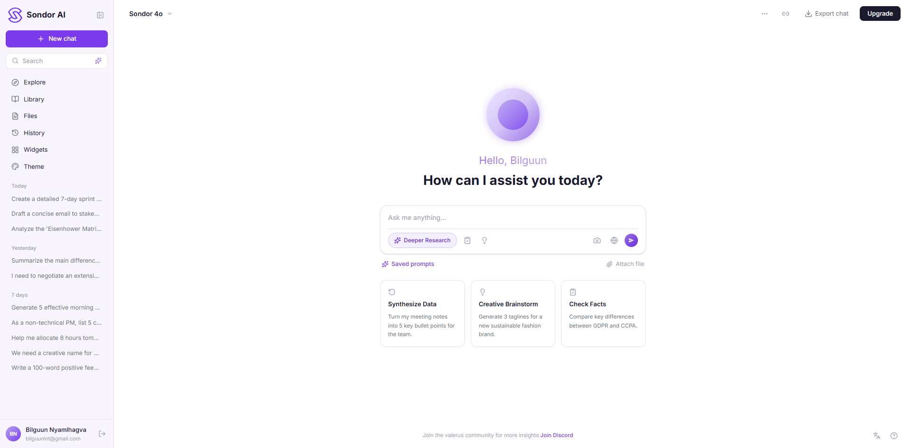
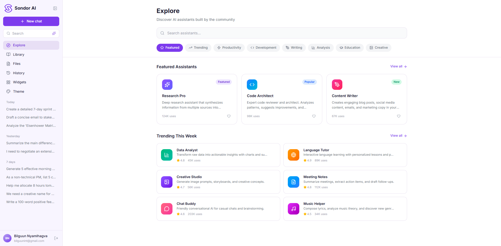
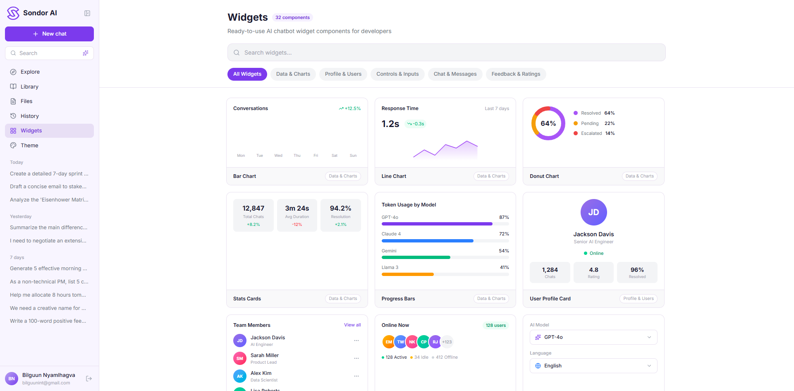

<div align="center">
  
  <h1>Sondor AI</h1>
  <p><strong>Modern AI Chatbot UI Kit</strong></p>

  
  
  
  

  <br>

  

  <br><br>

  <a href="https://chatbot-uikit.vercel.app/">Live Demo</a>
</div>

<br>

A modern, fully responsive AI chatbot interface built with **Next.js 16**, **Tailwind CSS v4**, **TypeScript**, and **Lucide React** icons. Designed as a production-ready UI kit for AI-powered chat applications.

## Screenshots

<div align="center">

### 🏠 Home — Chat Interface


<br>

### 🧭 Explore — AI Assistants


<br>

### 🧩 Widgets — Dashboard Components


</div>

## Features

- **Multi-page layout** — Home, Explore, Library, Files, History, Widgets, Theme, Profile
- **AI model selector** — Switch between 6 AI models (Sondor 4o, Ultra, Vision, Code, Mini, Reason)
- **Theme system** — Light / Dark / System mode with 6 accent colors (Purple, Blue, Emerald, Rose, Amber, Cyan)
- **Collapsible sidebar** — Full navigation with expand/collapse support
- **32+ widget components** — Pre-built UI widgets for dashboards
- **Profile page** — User profile, usage stats, and settings
- **Chat history** — Organized by Today, Yesterday, and 7 days
- **Dark mode** — Fully supported across all pages and components

## Tech Stack

| Technology | Version | Purpose |
|---|---|---|
| [Next.js](https://nextjs.org) | 16.2.4 | React framework (App Router) |
| [React](https://react.dev) | 19.2.4 | UI library |
| [Tailwind CSS](https://tailwindcss.com) | 4.x | Utility-first CSS |
| [TypeScript](https://typescriptlang.org) | 5.x | Type safety |
| [Lucide React](https://lucide.dev) | 1.8.0 | Icon library |

## Prerequisites

- **Node.js** 18.x or later
- **npm** 9.x or later

## Getting Started

### 1. Clone the repository

```bash
git clone https://github.com/bilguunint/chatbot-uikit.git
cd chatbot-uikit
```

### 2. Install dependencies

```bash
npm install
```

### 3. Run the development server

```bash
npm run dev
```

Open [http://localhost:3000](http://localhost:3000) in your browser.

## Available Scripts

| Command | Description |
|---|---|
| `npm run dev` | Start development server with hot reload |
| `npm run build` | Create optimized production build |
| `npm run start` | Start production server |
| `npm run lint` | Run ESLint for code quality checks |

## Project Structure

```
src/
├── app/
│   ├── globals.css          # Theme variables & Tailwind config
│   ├── layout.tsx           # Root layout with ThemeProvider
│   └── page.tsx             # Main page with view routing
├── components/
│   ├── ThemeProvider.tsx     # Theme context (mode, accent color)
│   ├── Sidebar.tsx          # Collapsible navigation sidebar
│   ├── MainContent.tsx      # Chat interface with model selector
│   ├── ExploreContent.tsx   # Explore page
│   ├── LibraryContent.tsx   # Library page
│   ├── FilesContent.tsx     # Files page
│   ├── HistoryContent.tsx   # Chat history page
│   ├── WidgetsContent.tsx   # Widget components showcase
│   ├── ThemeContent.tsx     # Theme settings page
│   └── ProfileContent.tsx   # User profile & settings
public/
└── assets/
    └── logo-{color}.png     # Per-theme logo variants
```

## Customization

### Accent Colors

Edit `src/components/ThemeProvider.tsx` to add or modify accent colors. Each color requires a full shade palette (50–900).

### Theme Variables

All CSS variables are defined in `src/app/globals.css` using Tailwind CSS v4's `@theme` directive with dark mode overrides.

## Deploy

### Vercel (Recommended)

```bash
npm run build
```

Deploy to [Vercel](https://vercel.com) with zero configuration — it auto-detects Next.js.

### Docker / Self-hosted

```bash
npm run build
npm run start
```

The production server runs on port 3000 by default.

## License

MIT
